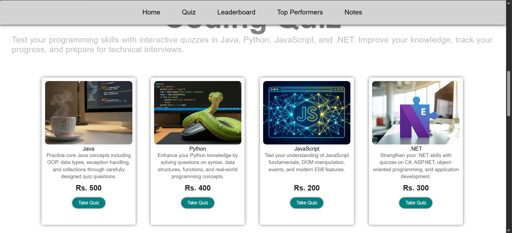
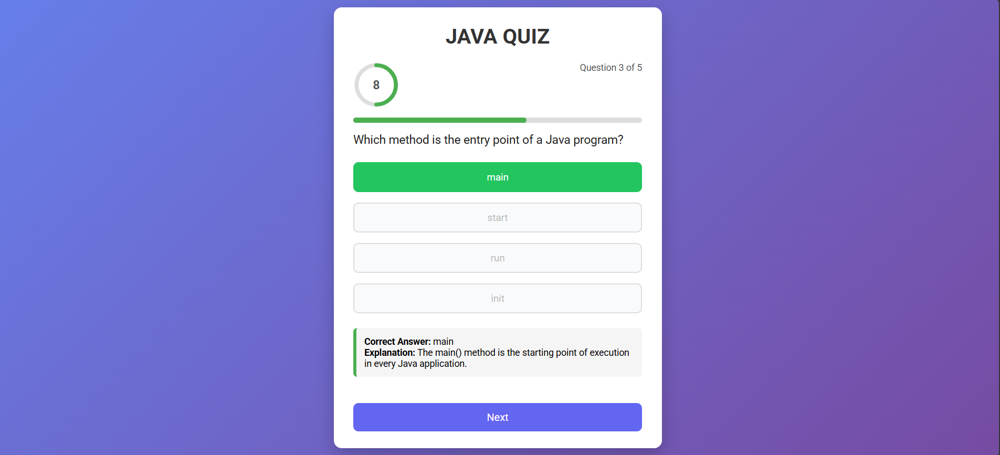
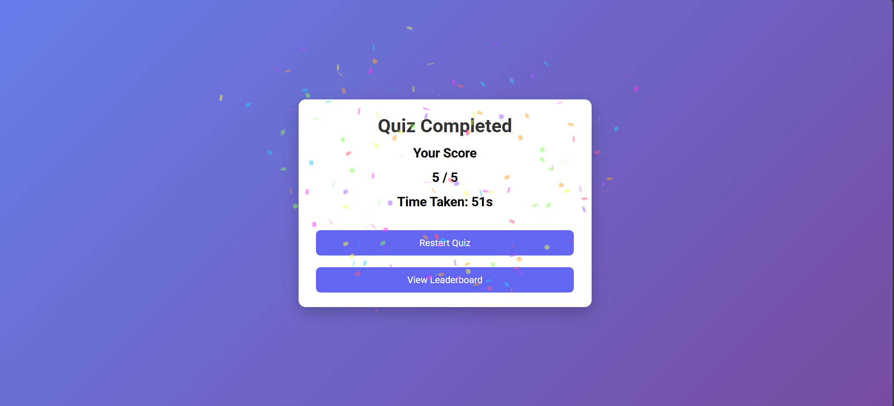
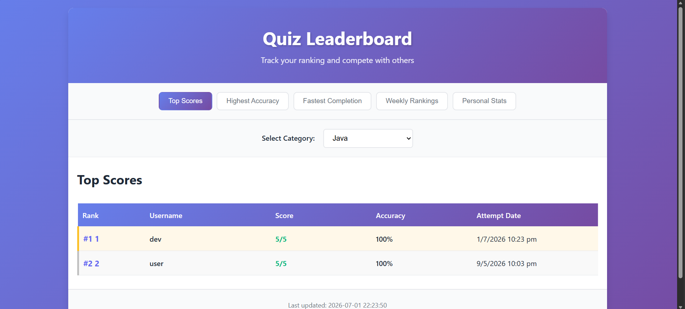

# 🧠 MasterQuiz

MasterQuiz is a full-stack coding quiz platform where users can register/login, take timed quizzes across multiple programming categories (Java, Python, JavaScript, .NET), track their scores, compete on live leaderboards, and upload a profile photo to appear among the top performers.

**Live repo:** [github.com/Avi21-sys/MasterQuiz](https://github.com/Avi21-sys/MasterQuiz)

---

## 📸 Screenshots

| Home Page | Taking a Quiz |
|---|---|
|  |  |

| Quiz Completed | Leaderboard |
|---|---|
|  |  |

---

## ✨ Features

- 🔐 **JWT-based authentication** — register/login with hashed passwords (BCrypt), protected API routes via Spring Security
- 📝 **Category quizzes** — Java, Python, JavaScript, and .NET, with randomized questions, a countdown timer, live progress bar, and instant answer feedback with explanations
- 🏆 **Leaderboard system** — Top Scores, Highest Accuracy, Fastest Completion, and Weekly Rankings, per category
- 📊 **Personal stats** — best score, average score/accuracy, average completion time, and current rank
- 🖼️ **Profile photos** — users can upload a photo that appears next to their name on the leaderboard and homepage "Top Performers" section
- 🎉 **Confetti celebration** on quiz completion
- 📱 **Responsive UI** built with vanilla HTML/CSS/JS

---

## 🏗️ Tech Stack

**Backend**
- Java 21, Spring Boot 4.0.3
- Spring Web MVC, Spring Data JPA, Spring Security
- MySQL
- JWT (`jjwt`) for stateless auth
- Maven

**Frontend**
- HTML5, CSS3, vanilla JavaScript (no framework)
- [canvas-confetti](https://github.com/catdad/canvas-confetti) for celebration effects

---

## 📁 Project Structure

```
MasterQuiz/
├── index.html / index.js / style.css        # Landing page + top performers
├── login.html / login.js / login.css        # Auth page
├── quiz.html / quiz.js / quiz.css            # Quiz-taking experience
├── leaderboard.html / leaderboard.js / leaderboard.css
│
└── quiz/QuizApp/                             # Spring Boot backend
    └── src/main/java/com/dev/QuizApp/
        ├── controller/    # REST endpoints (Login, Quiz, Results, Leaderboard, Profile)
        ├── service/       # Business logic
        ├── repository/    # Spring Data JPA repositories
        ├── entity/        # JPA entities (Question, Options, QuizResult, UserProfile)
        ├── dto/           # Data transfer objects
        ├── security/      # JWT filter, JwtUtil, SecurityConfig
        └── config/        # CORS, static file serving, password encoder, data seeding
```

---

## 🚀 Getting Started

### Prerequisites
- Java 21+
- Maven (or use the included `mvnw` wrapper)
- MySQL running locally
- A simple static file server for the frontend (e.g. VS Code "Live Server" on port 5500) — CORS is currently configured for `http://localhost:5500` / `http://127.0.0.1:5500`

### 1. Set up the database
Create a MySQL database matching your `application.properties`:
```sql
CREATE DATABASE quizdb;
```
Update `quiz/QuizApp/src/main/resources/application.properties` with your DB credentials if different from the defaults.

### 2. Run the backend
```bash
cd quiz/QuizApp
./mvnw spring-boot:run
```
The API will start on `http://localhost:8080`. Tables are auto-created via `spring.jpa.hibernate.ddl-auto=update`.

### 3. Add quiz questions
Populate the `question` and `options` tables (category values: `JAVA`, `PYTHON`, `JS`, `DOTNET`) — there's no admin UI yet, so this is currently done directly via SQL or a seed script.

### 4. Run the frontend
Serve the root project folder with a static server (e.g. Live Server on port `5500`) and open `index.html`. You'll be redirected to `login.html` if not authenticated.

### 5. Register and play
Register a new user, log in, pick a category, and start the quiz!

---

## 🔌 Key API Endpoints

| Method | Endpoint | Description |
|--------|----------|-------------|
| POST | `/api/register` | Create a new user |
| POST | `/api/login` | Authenticate and receive a JWT |
| GET | `/api/questions/{category}` | Get randomized questions for a category |
| POST | `/api/results/save` | Save a completed quiz result |
| GET | `/api/leaderboard/top-scores/{category}` | Top scores leaderboard |
| GET | `/api/leaderboard/highest-accuracy/{category}` | Accuracy leaderboard |
| GET | `/api/leaderboard/fastest-completion/{category}` | Speed leaderboard |
| GET | `/api/leaderboard/weekly/{category}` | Last-7-days leaderboard |
| GET | `/api/leaderboard/stats/{username}/{category}` | Personal stats |
| GET | `/api/profile/{username}` | Get/create a user profile |
| POST | `/api/profile/photo` | Upload a profile photo |

---

## ⚠️ Known Issues / TODO

- JWT secret and DB credentials are currently hardcoded in source — move to environment variables before deploying publicly
- CORS origins are hardcoded to `localhost:5500` — update for production domains
- No admin interface for adding quiz questions yet
- Uploaded profile photos aren't cleaned up when replaced

---

## 👤 Author

**Aviral Sangal** — [github.com/Avi21-sys](https://github.com/Avi21-sys)

## 📄 License

All rights reserved.
